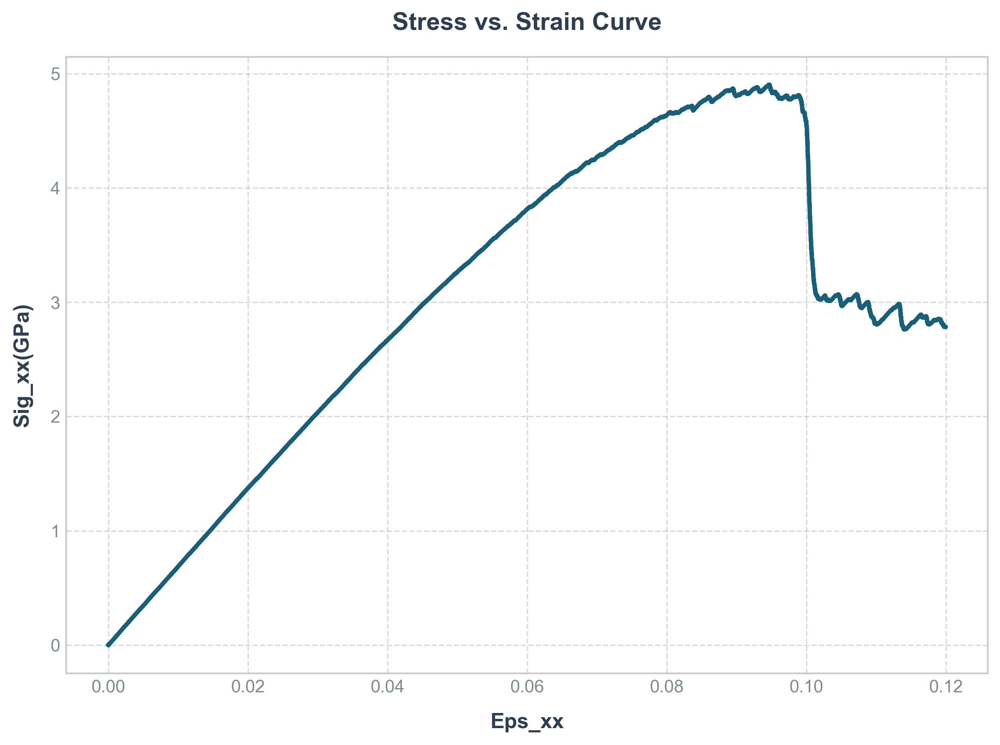

# mgkmc

[](https://mgkmc.readthedocs.io/en/latest/?badge=latest)
[](https://opensource.org/licenses/MIT)

Mesoscale kinetic Monte Carlo and athermal quasi-static simulation of plasticity in metallic glasses, using the Shear Transformation Zone model with an FFT-based spectral solver for mechanical equilibrium.



*Produced by `examples/4-uniaxial_tension_kmc/Example1/kmc_config_fast_patching.yaml`
(128x128 voxels, 10 K, strain rate 1e8 s⁻¹), plotted with
`tools/plot_summary_log.py`. Roughly 4 minutes on one core.*

## What problem this solves

Metallic glasses have no crystal lattice, so they have no dislocations. Plastic
deformation instead happens through **shear transformation zones** — small
clusters of atoms that rearrange collectively under stress. Tracking those
clusters atom-by-atom is limited to nanoseconds and tiny samples, far short of
the scales where shear bands actually form.

`mgkmc` works at the mesoscale instead. The sample is a grid of voxels, each
carrying `M` candidate shear orientations with activation barriers drawn from a
random distribution — the structural disorder of the glass. The simulation loop:

1. **Bias the barriers.** The local stress tensor lowers the activation barrier
   for favourably oriented shears and raises it for others.
2. **Select an event.** A kinetic Monte Carlo step picks which zone transforms
   and advances physical time by a residence time drawn from the total rate, so
   temperature and strain rate enter properly rather than as fitting knobs.
3. **Restore equilibrium.** The transformed voxel receives a shear eigenstrain.
   The resulting stress redistribution is solved spectrally: FFT to reciprocal
   space, apply the Green operator, transform back. This is what couples distant
   voxels and lets one event trigger another.
4. **Soften the neighbourhood.** Barriers near the transformed site are lowered,
   permanently and transiently. Without this the sample deforms homogeneously;
   with it, activity concentrates and a shear band forms.

The stress drop in the figure above is that feedback loop closing — an avalanche
of coupled events, followed by serrated flow along the band.

## Installation

Requires Python 3.10 or newer.

```bash
git clone https://github.com/siamak-attarian/mgkmc.git
cd mgkmc
pip install -e .
```

### FFTW

The spectral solver uses `pyfftw`, which needs the FFTW3 library. In most cases
`pip` installs a prebuilt wheel with FFTW already bundled and there is nothing
else to do — on Windows, for example, the wheel ships `libfftw3-3.dll` directly.

If no wheel matches your platform and Python version, `pip` falls back to
building from source, which needs the FFTW3 development headers **first**:

| Platform | Command |
|---|---|
| Debian / Ubuntu | `sudo apt-get install libfftw3-dev` |
| Fedora / RHEL | `sudo dnf install fftw-devel` |
| macOS (Homebrew) | `brew install fftw` |
| conda (any platform) | `conda install -c conda-forge fftw pyfftw` |
| Windows | Use the wheel (`pip install pyfftw`) or conda-forge; building FFTW from source is not recommended |

### Optional extras

```bash
pip install -e ".[test]"   # pytest
pip install -e ".[docs]"   # sphinx and the RTD theme
```

## Quick start

Every simulation is driven by one YAML file:

```bash
python run.py config.yaml
```

`config.yaml` in the repository root is a fully commented reference covering
every option. To run one of the bundled examples, work from its directory so the
output lands beside the config:

```bash
cd examples/1_uniaxial_tension_2d_homogeneous
python ../../run.py plane_stress.yaml
```

That writes `output_plane_stress/` with a per-step summary log, a global log,
and ParaView-readable `.vtu` files. Plot the stress-strain curve with:

```bash
python ../../tools/plot_summary_log.py output_plane_stress/summary_log.txt
```

The library can also be driven directly:

```python
import numpy as np
from mgkmc import ThermalSimulation

nx, ny, nz = 32, 32, 1
sim = ThermalSimulation(
    nx, ny, nz, M=20, gamma0=0.14,
    E_field=np.full((nx, ny, nz), 70.0),         # GPa
    nu_field=np.full((nx, ny, nz), 0.3),
    pixel=0.7,                                   # nm
    temperature=300.0,                           # K
    strain_rate=1e7,                             # 1/s
    output_dir="output_quickstart",
)
sim.run_simulation(
    n_global_steps=200,
    step_size=1e-4,
    component=(0, 0),                            # drive eps_xx
    stress_targets={(1, 1): 0.0, (2, 2): 0.0},   # free lateral contraction
)
```

## Examples

Six worked examples, each with its own README explaining what it demonstrates
and how to run it. They build up from pure elasticity to full KMC plasticity:

| | |
|---|---|
| [1 — 2D homogeneous](examples/1_uniaxial_tension_2d_homogeneous) | elastic baseline under three boundary-condition conventions |
| [2 — 3D on one layer](examples/2_uniaxial_tension_2d_3d_homogeneous) | consistency check between the 2D and 3D solvers |
| [3 — heterogeneous](examples/3_uniaxial_tension_heterogenous) | correlated random modulus fields; λ and μ varied independently |
| [4 — KMC plasticity](examples/4-uniaxial_tension_kmc) | the full STZ model, with and without the fast-patching approximation |
| [5 — small vs finite strain](examples/5_uniaxial_tension_finite_strain_2d) | SVK, neo-Hookean and Murnaghan against the small-strain baseline |
| [6 — 3D finite strain](examples/6_uniaxial_tension_finite_strain_3d) | finite strain on a true 3D grid |

### Verification

Example 1 is homogeneous linear elasticity, so its answer is known in closed
form. Measured against theory:

| Boundary condition | Measured | Closed form |
|---|---|---|
| plane strain | 94.231 GPa | λ+2μ = 94.231 |
| plane strain in zz, σ_yy relaxed | 76.924 GPa | E/(1−ν²) = 76.923 |
| plane stress | 70.003 GPa | E = 70.000 |

Example 2 reproduces all three through the 3D code path to within 1e-5.

## Documentation

Full API reference and a configuration guide covering every key:
**[mgkmc.readthedocs.io](https://mgkmc.readthedocs.io/)**

To build locally:

```bash
pip install -e ".[docs]"
python -m sphinx -b html docs docs/_build/html
```

## Repository layout

```
mgkmc/        the package: solvers, STZ catalogue, KMC, analysis
run.py        command-line entry point, driven by a YAML config
config.yaml   fully commented reference configuration
examples/     six worked examples, each with a README
tests/        pytest suite
tools/        post-processing scripts (stress-strain plotting)
benchmarks/   profiling scripts
dev/          exploratory and debugging scripts, not part of the package
docs/         Sphinx sources
```

## Status

**Research code, with a paper in preparation.** It is in active use and the
results above are reproducible, but the API and configuration schema are not
stable and may change between commits. Expect to read code when adapting it to a
new problem.

A C++ port of the small-strain solver, for longer runs, is at
[mgkmc_cpp](https://github.com/siamak-attarian/mgkmc_cpp).

## Contributing

See [CONTRIBUTING.md](CONTRIBUTING.md). Issues and pull requests are welcome.

## License

MIT — see [LICENSE](LICENSE).

## Citation and contact

A paper describing the model is in preparation. Until it appears, please cite
this repository directly, and get in touch if you are using it in published
work.

Siamak Attarian — <siamak.attarian@gmail.com>
